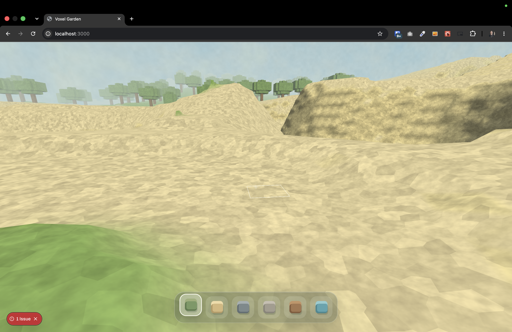
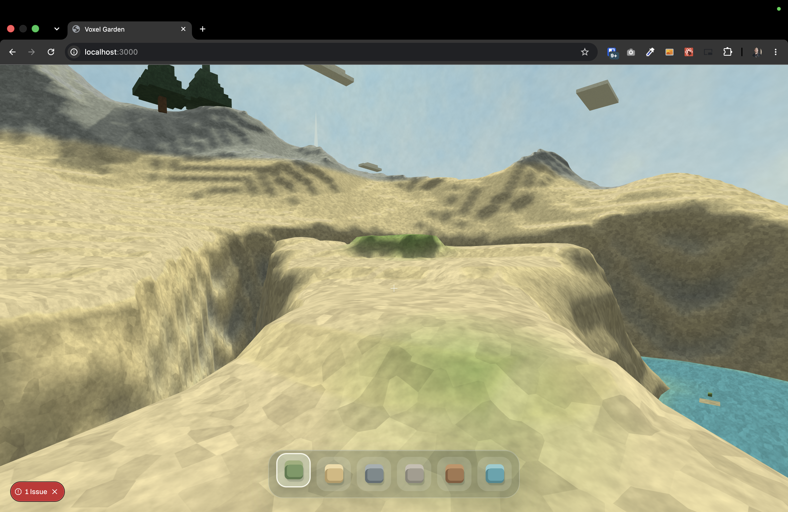
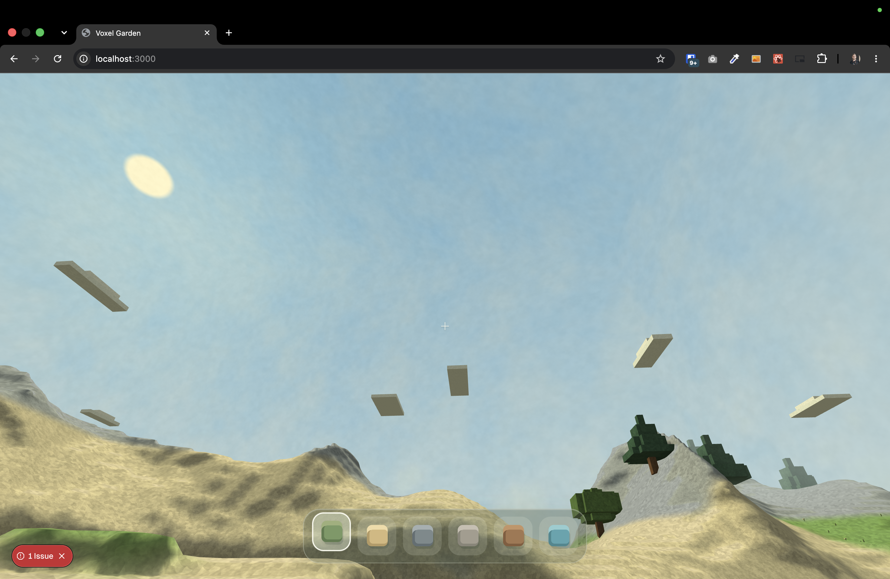

[x]

The game should contain the textures.

- The textures should be applied to all surfaces in the game.
- The textures should be still, simple and low poly.
    - By low-poly, I don't mean the simple 2D grid, but really some nicely generated textures using vector graphic techniques.
    - But everything in the game should be procedurally generated.
- The textures should be consistent with the overall art style of the game.
- The textures should be procedurally generated.
- Use some noise algorithm, which will be applied to the textures.
    - The noise should be very fine. Each pixel screen should be the noise pixel itself.

---

[x]

Enhance game textures and add procedural noise

- The procedurally generated textures should have smaller details, making them appear more refined
- There shouldn't be solid colors or simple gradients used. Instead, use a noise generator.
- The noise should be also procedurally generated.

---

[x]

Enhance game textures to make them more visually appealing and natural

- The textures are very basic and lack detail.
- The textures should have multiple levels of detail, with both large and small features to create a more realistic and engaging visual experience.
- For each material type, there should be unique algorithm to procedurally generated textures.
- Each material should have unique characteristic and visual style, reflecting its real-world counterpart.
- But keep in mind that everything is procedurally generated.
- On the other hand, the sky is looking great.

