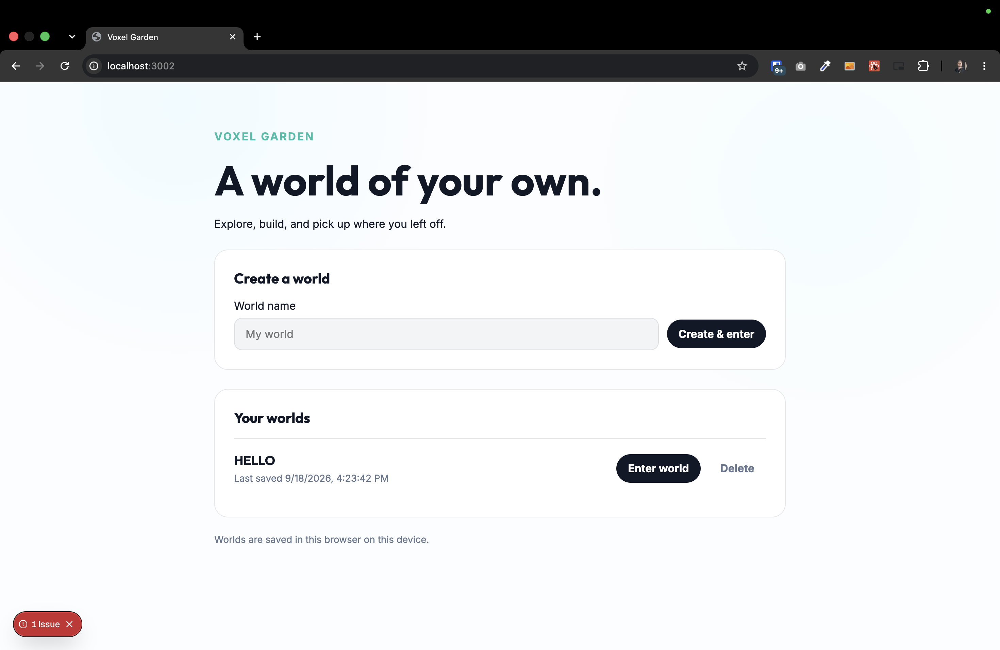
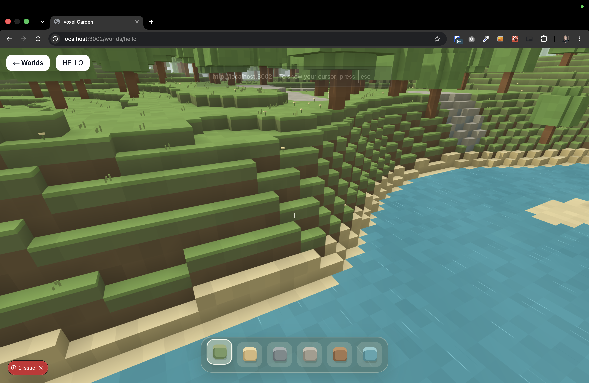

[x]

The game should, contain multiple worlds.

- You can pick the world in the welcome screen.
- You can create new worlds. Enter existing ones or delete them.
- Each world has its own separate state, including player progress and built structures.
- Each world should have its own key in the local storage.
- The entries in the local storage should be prefixed by the save version of the game.
    - Do not keep the backward compatibility for now.
- The world which I am currently in should be persisted in the URL, for example, `https://game.com/worlds/my-world`.
- The position of the player in each world and the world itself should be saved in the local storage.

---

[ ]

The welcome screen should look better.

- Welcome screen now looks like a regular boring business app, but it should look like a game.
    - 
- On the welcome screen, there should be also a preview of each world.
- Also, the navigation back to the welcome screen inside a game looks like a button on a normal website, it should be styled to match the game's aesthetic.
    - 