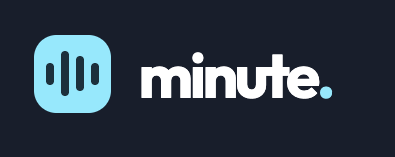

[x]

Create an app "Minute" for recording meetings

## Basic info

Create an app for recording meetings, which can record a meeting and create todos from this meeting. This app will be called "Minute".

The app is the progressive web app. It can be installed on both desktop and mobile devices, providing a native-like experience while being accessible through a web browser.

You are working on a boilerplate directory. Remove the boilerplate things and replace them with this app. 

## Dictionary

- User: An individual who interacts with the app, can create and manage workspaces, meetings, todos....
- Workspace: A virtual space where meetings, transcripts, and todos are organized and managed
- Meeting: A scheduled gathering of individuals to discuss specific topics
- Meeting studio: a page where the recording of the meeting is happening during the meeting call 
- Meeting Transcript: A written or recorded version of the spoken content during a meeting, capturing the discussions and exchanges verbatim. The transcript is always 1:1 with the meeting. A meeting can exist without a transcript, but a transcript must have a meeting. Transcript isn't living on its own. It is always generated from the meeting. 
- Todo: An actionable item derived from the discussion in a meeting, which needs to be completed after the meeting. Todos are living in the workspace. The connection between meetings and todos is M:N. 

## Basic structure

User can have multiple workspaces. Now, for the first version, the connection between users and workspaces is 1:N, but in the future, workspaces can be shared among multiple users. Keep this in mind when designing the structure. 

For the first version create one hardcoded user with 1 sample workspace but ability to create multiple workspaces.

At the top level are workspaces. By default, a new user gets an initial workspace with todos, which are also serving as a tutorial. 

Each workspace has its own unique id in URL, for example: `/<workspace_id>`

Within each workspace, users can create and manage meetings, transcripts, and todos. Meetings are scheduled events where discussions take place. Transcripts are converted automatically from the spoken content of meetings, capturing the discussions verbatim.

Each meeting and todo within a workspace also has its own unique id, which can be used to directly access them via the URL, for example: `/<workspace_id>/meetings/<meeting_id>` for a specific meeting.

## Meeting records

Each meeting has some basic metadata, such as the date of the meeting, participants, and description....

Allow to create meetings before they are happening or ad hoc. 

During the meeting, there is a meeting studio. 

In the studio, you can record multiple recordings by recording from the microphone or by dragging and dropping the MP3 or other media files. You can record multiple recordings, add multiple files, or combine these together. 

After the meeting is finished, the meeting transcript is automatically created. From this meeting transcript, the todos are created. 

## Todos

Each todo has a title, description, due date, and status (e.g., pending, completed). Todos are linked to the meeting transcripts from which they were derived, providing context and traceability. Users can create, update, and delete todos within the workspace.

Todos can have a hierarchy among each other. There can be parent and child todos, allowing for more granular task management within the workspace.

Each Todo has its own unique URL. 

When the TODO is referenced somewhere by its unique URL, it should as a nice todo chip component.

## Languages

The app should support multiple languages to cater to a diverse user base. Users should be able to switch between languages seamlessly, for now support English and Czech.

There are two types of languages:
1. The language of the app and its UI - affects the text, labels, and messages displayed throughout the application. - this should be taken from the browser preferences and can be changed in the UI and saved per-user
2. The language of the workspace and meeting - every workspace can have 1 or N assigned languages, languages are inherited from the meetings but can be changed when the meeting is created. 

## Technical details

- Is a progressive web app. It's running in the browser but can be installed. 
- Workspaces, meetings, and todos have their own unique URLs, when referencing them anywhere in the app, they should be displayed as a nice chip component. 
- Descriptions should be in the Markdown format. 

## Coding quality

Keep in mind the "do not repeat yourself" principle. Avoid duplicating code and logic across different parts of the app.
When there is an opportunity to make some abstraction, do it. 
Big files: maximum length of the file should be 300 lines. 

## Copywriting

Avoid the filler phrases and unnecessary words, keeping the copy concise and to the point.

## UI

- The UI should be clean, intuitive, and responsive, providing a seamless experience across different devices and screen sizes.

The version of the app should work in a two-column layout. There should be a left column with the organization and a right column with the main content. The layout should be responsive, adjusting gracefully to different screen sizes and orientations. In the light mode the left column should have a dark background, while the right column should have a light background. 

Implement both dark and light mode. 

