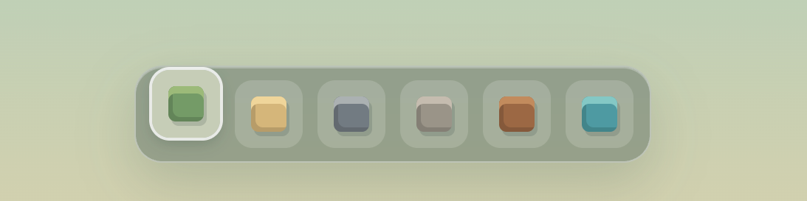

Create a simple game with a map and the ability to build in 3D voxel space (like Minecraft)

- The game should be the most prominent part of the app. It should fill the entire screen
- The game is first-person perspective and user can look around freely.
- For now, you are not implementing gameplay, like resources, game turns, or players. You are just drafting the perfect game map with free mode and free resources. 
- For now, the game will be single-player versus some hard-coded AI. 

## Controls

- W/A/S/D to move
- Mouse to look around
- Left click to place a block
- Right click to remove a block
- There is a graphical crosshair in the center of the screen for aiming.

## UI

- The UI should be minimalistic. 
- There should be no bullshit texts or things. There should be just a very simple, minimalistic tray with materials for building in the game.
- Get inspiration from the Mac app tray. 
    - 
- There should be only a map and a simple tray on the bottom with the buildings. 
- No branding, compass, controls, some fake game information, etc. This will be added later. 

## Graphics

- The graphics should have a consistent low-poly, 3D voxel style in first-person perspective.
- The light should be only emissive. There should be no shadows in the game. 

## Materials

- The materials be:
    - grass
    - sand
    - rocks
    - gravel
    - wood
    - water

## Technical Requirements

- Use Babylon.js for rendering the 3D voxel environment.

## Code quality

- Create abstractions. For example, for the Turing transitions, there should be some reusable system which will work modularly. 
- Do not hardcode anything. Everything should be like a plugin. Each building and terrain should be plugable.
- Ensure that the code is modular and maintainable, allowing for easy addition of new features and content without modifying the core systems.