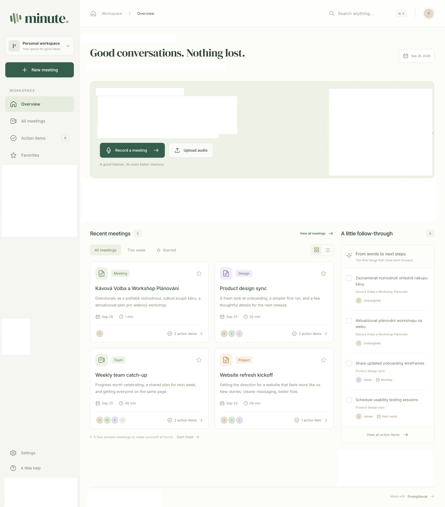

Create an app which can record my calls and create notes and action items from this call. 

**This is how the app should look:**

- The app should be named "Minute." 
- The app consists of the dashboards and recording studio. 

## Terms

- Call: A recorded conversation that can generate notes and action items.
- Action Item: A task or follow-up that arises from a call, which needs to be tracked and completed.
- Workspace: A container for calls, action items, and related data.

## Workspaces

- A workspace is a container for calls, action items, and related data.
- Workspace is isolating these things into a separate container.
- In the future, a workspace can be shared as a whole with multiple users or organizations. 

## Recording studio

- Recording studio is on `/<workspace_id>/recording` and it's opening in a new tab. 
- The app should have a recording interface with pause, resume, and playback functionality.
- The recording studio should be on a separate screen. 
- There should be an option to record from the microphone or upload the MP3 / MP4 / M4A / MPEG / WAV / WebM file. 
- There should be an option for putting multiple recordings in one call, for example, multiple microphone recordings, multiple files, or a combination. 

## Dashboard(s)

- Dashboard is on `/<workspace_id>/`
- There should be some simple overview page. 
    - View page should contain some statistics, like:
        - number of the calls
        - action items
        - total duration of the calls
- There should be a page with action items.
- There should be a page with calls. 
    - On this page, there are three types of view: the blocks list, the detailed list, and the calendar. 

## Actions items

- Action item is a task or follow-up that arises from a call, which needs to be tracked and completed.
- Action items have a hierarchy. There can be sub-action items. 
- An action item can have a parent, children, and also related action items. There is both a tree structure and a cyclic structure. 
- Action items are always assigned to one or more calls, but they are living in the workspace. When I am doing a new call, in this new call I have access to the old action items. 
- Is that I can work on one project and have multiple calls during that day on that project, and the same action items arise from multiple calls or are affected by multiple calls. 
- Action item has its own card. 
- An action item can have metadata such as description, change log, discussion, and due date. 

## User system, and data

- The app should have a user authentication system with sign-up, login, and password recovery functionality.
- For now, users will be mocked. 
- There will be two mocked users with fake username and password. 
- These users will have the data in the local storage. 
- In future, the proper sharing and user system will be implemented. 

## Sample data

- Each user has its own personal workspace initialized by default. 
- When the workspace is initialized it should contain some sample calls and action items to demonstrate the functionality of the app.
- Theese should also serve as a demo and manual 
- Especially action items can be used as a guide on how to use the app. 

## Languages

- The app can work in both English and the Czech language. 
- Calls can be in any language. 

## Exports and integrations

- In the future, you will be implementing exports and imports from external services like Google Calendar, Trello, Jira, etc., but for now, just think about this during the architecture implementation. 
- The only thing you are implementing is some exports. You should be able to export the things into the CSV, Markdown, and PDF. 

## Coding Standards

- Follow consistent naming conventions for files, variables, and functions.
- Use clear and descriptive names for all UI elements and components.
- Ensure code is modular and reusable wherever possible.
    - Separate the files into abstract blocks and extract reusable components.
- Keep in mind DRY (Don't Repeat Yourself) principles to avoid code duplication.

## UI

- The UI should be clean, minimalistic, and user-friendly.
- There should be both light and dark mode options.
- The UI should be responsive and work well on different screen sizes.
- There are breadcrumbs which are navigable and clickable. 
- There is a search. 

## Misc

Nepřidávej automaticky supporting copy, subheadline, lead text ani vysvětlující věty pod nadpisy sekcí. Pokud text nepřináší novou informaci, vůbec ho nevytvářej. Nadpis a samotné UI musí být dostatečně srozumitelné bez generického vysvětlování. Zakázané jsou výplňové formulace typu „Každý X má své místo…“, „Vše přehledně na jednom místě“, „Jednoduše a efektivně…“